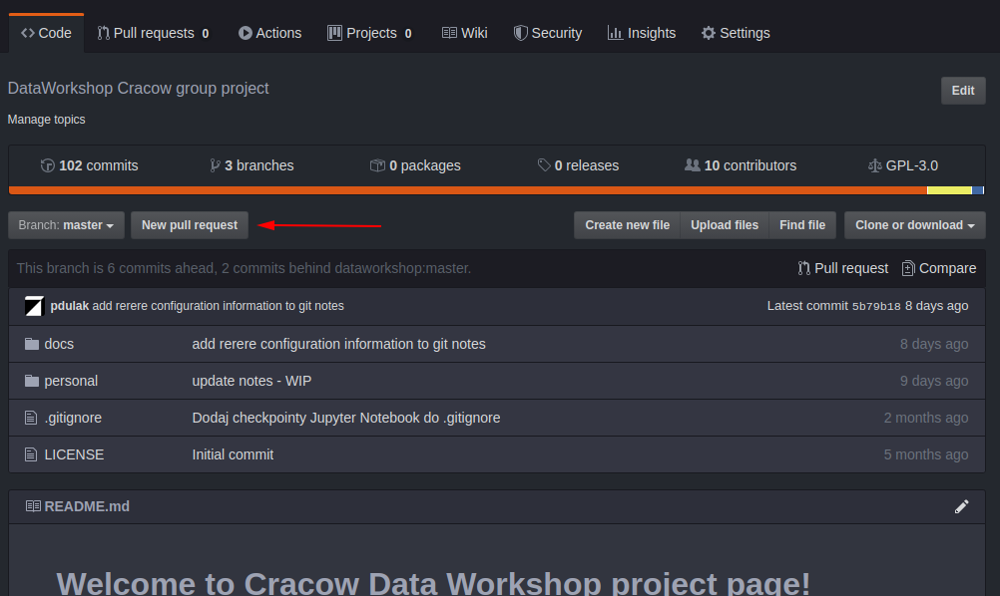
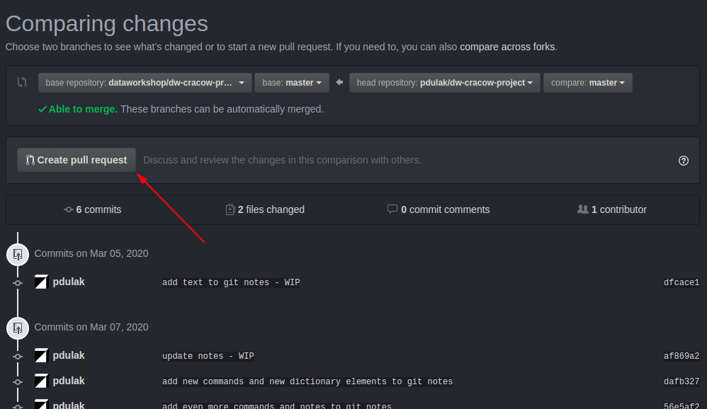

# Spis treści

0. Git to nie Github
1. Pierwsze kroki - kiedy dołączasz do projektu
2. Mam już swój Fork i co dalej? (lokalne repozytorium Git)
3. Codzienna praca z Git
4. Wysyłanie moich zmian do głównego repozytorium projektu - Pull Request
5. Pobieranie aktualnej wersji głównego repozytorium
6. Praca z gałęziami (branch)
7. Rozwiązywanie konfliktów
8. Materiały dodatkowe
9. Uwagi
10. Słowniczek

# 0. Git to nie Github

Git to narzędzie - program do kontrolowania wersji kodu który piszemy. Git tworzy i zarządza repozytoriami kodu.
GitHub to miejsce gdzie możemy nasze repozytoria przechowywać, zarządzać nimi w bardziej ogólny sposób. 

# 1. Pierwsze kroki - kiedy dołączasz do projektu

Na początku skupimy się na przygotowaniu Twojej osobistej kopii naszego projektowego repozytorium. Będzie to Fork czyli taka kopia nad którą masz pełną kontrolę i którą przechowujesz na swoim koncie GitHub. Dzięki temu masz coś czym możesz się pochwalić (może się przydać do portfolio czy CV) a jednocześnie praca nad projektem jest bezpieczna (nie popsujesz niczego niechcący). 

Jak zatem przygotować włąsny fork?

1. Załóż konto na [GitHub](https://github.com/) jeśli jeszcze go nie posiadasz
2. Nasze projektowe repozytorium znajduje się na GitHub pod adresem:
https://github.com/dataworkshop/dw-cracow-project/
3. Będąc zalogowanym do GitHub możesz wejść na stronę naszego repozytorium i kliknąć `Fork` w prawym górnym rogu strony. Fork to Twoja prywatna kopia naszego repozytorium. Masz nad nim pełną władzę i możesz pracować w nim nie obawiając się że coś zepsujesz w naszym repozytorium projektowym.

# 2. Mam już swój Fork i co dalej? (lokalne repozytorium Git)

Twój fork jest kopią repozytorium projektowego, ale nie pracuje się nad nim wygodnie kiedy jest w całości gdzieś w internecie - na serwerach GitHub. Nie daje się wtedy łatwo uruchamiać skryptów Pythona czy też szybko modyfikować plików. Żeby wygodnie pracować nad swoim kodem, należy mieć kopię repozytorium na swoim komputerze. Będziemy zatem potrzebować lokalnej kopii Twojego repozytorium oraz zainstalowanego narzędzia Git. 

Do pracy z narzędziem Git polecam linię poleceń (konsolę). Można używać także narzędzi wizualnych (Git GUI) czy obsługi Git wbudowanej w edytor programistyczny, ale wszystkie komendy w tym dokumencie będą się odnosić do konsoli z obsługą Git.

1. Zainstaluj Git na swoim komputerze. W Linux zazwyczaj wystarczy w konsoli wpisać: `sudo apt install git`, dla Windows można pobrać na przykład z https://git-scm.com/download/win. Zerknij do sekcji **9. Uwagi** na dole tego dokumentu żeby zobaczyć proponowane opcje podczas instalacji oraz podstawową konfigurację po instalacji.
2. Załóż katalog w którym będziesz pracować, w tym miejscu utworzymy lokalną kopię Twojego repozytorium. Uruchom konsolę Git tak żeby pracowała w tym nowo utworzonym katalogu. 
3. Na stronie GitHub otwórz sobie swoje repozytorium, po prawej stronie ekranu znajdziesz przycisk "Clone or download". Po jego kliknięciu pojawi się małe okno z adresem repozytorium. Ten adres należy skopiować. Ważne żeby pobrać wersję HTTPS chyba że wiesz co robisz pobierając wersję SSH :) 
4. W konsoli Git na swoim komputerze wykonaj komendę: `git clone . [tutaj skopiowany adres]` czyli na przykład: `git clone . https://github.com/kowalski/dw-cracow-project.git`. W ten sposób utworzyłeś lokalną kopię swojego repozytorium, na której będziesz pracować lokalnie.

# 3. Codzienna praca z Git

Podczas swojej codziennej pracy z repozytorium staraj się utrzymywać swój kod w katalogu `/personal/[Twój Nick]` w ten sposób nie zrobisz bałaganu. Warto na poszczególne mniejsze projekty zakładać dodatkowe podkatalogi albo odpowiednio nazywać pliki. 

Git służy do kontroli wersji kodu który piszesz. Nie robi tego jednak automatycznie. Należy co jakiś czas wprowadzić swoje zmiany do repozytorium. Taką operację nazywa się `commit`. W jej wyniku Git zapamięta stan Twojego repozytorium, a właściwie tych plików które będziesz chciał zapamiętać. 

W całym dokumencie zakładamy że pracujesz na domyślnej gałęzi (master) - nie jest to polecane w większych projektach, ale jeśli to wiesz to pewnie ten dokument nie jest Ci potrzebny. Jeśli tego nie wiesz (albo po prostu nie wiesz o co chodzi), to nie będziemy teraz dodawać kolejnego poziomu skomplikowania. Po prostu wiedz że pracujesz na gałęzi `master` lub na `branch master`. 

## 3.1. Commit

Aby wykonać `commit` swoich zmian, należy najpierw wskazać Gitowi które pliki chcesz uwzględnić. Robi się to wykonując komendę: 

`git add [ścieżka i nazwa pliku]` 

czyli na przykład 

`git add personal/kowalski/test.py` 

W ten sposób przygotowaliśmy plik - nazywa się to `staging`. Możesz też spotkać się z określeniem że pliki zostały wprowadzone do indeksu (innymi słowy indeksu rzeczy które zostaną zapisane podczas commit).

Możemy też dodawać pliki "hurtem" pisząc na przykład: 

`git add personal/kowalski/*.py` 

aby dodać wszystkie pliki z rozszerzeniem `.py`

Mając przygotowane wszystko co chcemy, wykonujemy komendę 

`git commit` 

która wprowadzi nasze zmiany do lokalnego repozytorium. Zostanie otworzony edytor w którym powinniśmy wpisać komentarz do naszych zmian. 

Jeśli chcemy wstawić komentarz od razu przy wykonywaniu komendy (zamiast pisać go w edytorze), można to zrobić pisząc: 

`git commit -m "Treść komentarza"`

Commity powinny być małe, częste i spójne (dotyczące danej funkcjonalności). Commit nie musi działać ani "się kompilować" bo commit dokumentuje kroki Twojej pracy.

## 3.2. Ignorowanie plików

Jeśli czegoś nie chcemy zachowywać w naszym repozytorium (pliki z danymi, pliki tymczasowe, pliki z hasłami i tokenami), należy je wykluczyć za pomocą odpowiedniego wpisu w pliku `.gitignore`. Plik ten zakładamy w swoim katalogu `personal` i wpisujemy do niego nazwy plików lub katalogów które nie powinny być brane pod uwagę przez Git. Każdy wpis zajmuje osobną linijkę. Przykładowa treść pliku `.gitignore`:

```
*.tmp
tego-nie-commituj.txt
data/*
```

Powyższy plik `.gitignore` wskazuje że powinny być ignorowane wszystkie pliki z rozszerzeniem `.tmp`, plik o nazwie `tego-nie-commituj.txt` oraz cała zawartość katalogu `data`

## 3.3. Wysyłanie zmian do GitHub

Warto aby Twoje zmiany do repozytorium nie pozostawały wyłącznie na Twoim komputerze. Aby wysłać je do Twojego repozytorium na GitHub, wykonaj polecenie 

`git push origin master` 

Spowoduje to "wypchnięcie" Twoich zmian do zdalnego repozytorium na GitHub.

Zauważ że w ten sposób Twój kod znajduje się zarówno na Twoim komputerze, jak i w Twoim repozytorium na GitHub. Każda osoba znająca adres Twojego repozytorium może teraz obejrzeć twój kod i skorzystać z niego. Możesz też wysłać komuś link do konkretnego pliku lub konkretnego commitu w którym znajduje się kod który chcesz komuś pokazać.

# 4. Wysyłanie moich zmian do głównego repozytorium projektu - Pull Request

Pamiętasz że pracując na swoim forku tak naprawdę pracujesz na swoim repozytorium nad którym masz pełną kontrolę? To jest Twoja kopia naszego repozytorium projektowego. 

Warto co jakiś czas podzielić się swoim kodem z resztą zespołu projektowego i wrzucić swoje zmiany także do głównego repozytorium projektu. W ten sposób osoby zaangażowane nie będą musiały przeszukiwać wszystkich Waszych repozytoriów tylko znajdą Wasz kod także w naszym wspólnym repozytorium.

Ponieważ nie możesz wysłać swoich zmian bezpośrednio za pomocą narzędzia Git, możesz wykorzystać mechanizm który jest wbudowany w GitHub. Każdy fork pamięta swojego "rodzica" czyli repozytorium z którego jest skopiowany. Można zatem poprosić o przyjęcie Twoich zmian do głównego repozytorium. Taka prośba o przyjęcie zmian nazywa się **pull request**. 

Jak zatem wykonać pull request? Wejdź na swoje konto GitHub i do swojego forka naszego repozytorium projektowego. Zobaczysz tam przycisk `New pull request` który należy klinkąć.


Pojawi się strona z podsumowaniem Twojego pull request. Przed zatwierdzeniem prośby, warto przejrzeć zmiany które planujesz wysłać. Jeśli jest tam coś czego nie chcesz wrzucać do repozytorium projektowego, wróć do pracy nad swoim repozytorium. Usuń nadmiarowe pliki, uporządkuj swoją pracę i wtedy ponownie wykonaj pull request. Jeśli chcesz zatwierdzić swoją prośbę, kliknij przycisk `Create pull request`.


Z Twojej strony to tyle. Teraz osoby prowadzące projekt mają czas na przeglądnięcie Twoich zmian i zatwierdzenie Twojego pull request. 

Kiedy zostanie zatwierdzony, Twój kod będzie widoczny dla wszystkich w głównym repozytorium projektu.

# 5. Pobieranie aktualnej wersji głównego repozytorium

Główne repozytorium projektu ciągle się zmienia. Różne osoby wysyłają swoje pull request, pojawia się nowy kod, także Twoje skrypty czy dokumenty. Co jakiś czas warto zatem zadbać o to żeby Twój fork posiadał aktualną wersję plików z głównego repozytorium.

## 5.1. Przygotowanie Twojego repozytorium do aktualizacji

W praktyce da się wykonać aktualizację Twojego repozytorium już na poziomie GitHub. Tutaj jednak pokażę Ci jak zrobić to za pomocą Twojego lokalnego repozytorium na Twoim własnym komputerze. 

Jeśli nie robiłeś tego nigdy wcześniej, pierwszym krokiem jest poinformowanie Twojego lokalnego repozytorium skąd może pobrać aktualizacje. Takie repozytorium źródłowe zazwyczaj nazywane jest `upstream` i my także użyjemy takiej nazwy. 

Utwórzmy zatem połączenie do zdalnego repozytorium źródłowego (głównego repozytorium naszego projektu). Na swoim komputerze, będąc w katalogu z Twoim lokalnym repozytorium, wykonaj komendę:

`git remote add upstream https://github.com/dataworkshop/dw-cracow-project.git`

W ten sposób poinformowaliśmy Git o tym że Twoje repozytorium ma nie tylko `origin` czyli zdalną kopię na GitHub, ale także `upstream` czyli źródło z którego kiedyś został wykonany fork.

## 5.2. Aktualizacja Twojego lokalnego repozytorium

Mając już skonfigurowany `upstream` wykonujemy najpierw pobranie danych ze źródłowego repozytorium:

`git fetch upstream master`

A następnie ich połączenie z naszym lokalnym repozytorium:

`git merge upstream/master`

Te dwa kroki powodują że w Twoim lokalnym repozytorium (na Twoim komputerze) pojawiły się wszystkie zmiany które zaszły w głównym repozytorium projektu. 

## 5.3. Wysłanie aktualnej wersji Twojego lokalnego repozytorium na GitHub

Skoro swoje lokalne repozytorium masz już zaktualizowane, warto teraz "wypchnąć" te aktualizacje także do Twojego repozytorium na GitHub - do twojego forka. 

Robi się to identycznie jak wysłanie Swoich zmian (swoich commitów) za pomocą komendy:

`git push origin master` 

# 6. Praca z gałęziami (branch)

Czeka na napisanie...

# 7. Rozwiązywanie konfliktów

Czeka na napisanie...

# 8. Materiały dodatkowe

* https://devstyle.pl/2018/10/26/5-sposobow-na-prace-z-gitem/
* Masz coś wartego uwagi? Daj znać!

# 9. Uwagi

## 9.1. Instalacja Win: git-scm.com

Podczas instalacji GitScm pod Windows, warto wybrać następujące opcje: 

* Windows Explorer Integration -> Git Bash here
* Default Text Editor -> VIM (zobacz niżej konfigurację edytora)
* Use Git From -> Windows Command Prompt
* Terminal Emulator -> MinTTY

## 9.2. Konfiguracja git

Po zainstalowaniu Git, należy wykonać konfigurację globalną:

`git config --global user.name "Jan Kowalski"`

`git config --global user.email "jan.kowalski@gmail.com"`

Można dodatkowo włączyć mechanizm zapamiętywania rozwiązań do konfliktów (rerere)

`git config --global rerere.enabled true`

Pod windows można użyć innego edytora - będzie używany do commit i merge:

`git config core.editor notepad`

## 9.3. Komendy które mogą się przydać

Ale zasadniczo bez wyjaśnień co robią :)

```
git clone [skąd]
git clone [skąd] .
git add
git add [nazwa_pliku]
git add [*.py]
git add -i = dodawanie interaktywne
git add -p = dodawanie w trybie patch plik po pliku
git commit
git status
git diff
git diff --word-diff
git diff --cached = zmiany w staging area
git difftool
git log
git log --oneline
git log -n4 
git log --since='{15 minutes ago}'
git tag [nazwa_tagu] = ten jest 'lightweight'
git tag [nazwa_tagu] -a -m "komentarz" = ten jest annotated
git tag [nazwa_tagu] [commitSHA] -a -m 
git tag -d [nazwa_tagu] 
git branch [nazwa_nowej_gałęzi]
git branch = lista gałęzi
git branch -d = kasowanie
git branch -m [nowa_nazwa_branch] = rename aktualnej gałęzi
git branch -vv = pokazuje także związki branchy z remote
git branch -a = pokazuje także gałęzie zdalnych repozytoriów o których wie nasz lokalny git
git checkout [branch_name]
git checkout [tag_name]
git checkout [commitSHA]
git checkout [commitSHA~4]
git checkout -b [nazwa_nowej_gałęzi]
git checkout @^ -- nazwa_pliku = pobiera do working copy wersję pliku z commit HEAD -1
git checkout [commitSHA] -- nazwa_pliku = pobiera wersję pliku z konkretnego commit
git checkout -- nazwa_pliku = pobiera wersję pliku z HEAD
git merge
git merge --no-ff
git cherry-pick [commitSHA]
git remote
git remote -v
git remote show origin
git remote add [nazwa_remote] [adres]
git remote rename [stara_nazwa] [nowa_nazwa]
git push
git init --bare
git push [jaki_remote] [jaki_branch]
git push [jaki_remote] [jaki_branch] -u = dodaje mapowanie do upstream branch na przyszłość
git push [jaki_remote] [jaki_branch]:[nazwa_branch_w_remote] = wysyła mój branch do brancha o innej nazwie w remote
git push [jaki_remote] :[nazwa_w_remote] = wysyłam "nic" do brancha w remote czyli kasuję tamten branch w remote
git push [jaki_remote] --delete [nazwa_w_remote] = jak wyżej
git push --mirror [jaki_remote] = wysyła wszystko, gałęzie, tagi itp
git push [jaki_remote] [nazwa_tagu]
git push --tags = wysyła wszystkie tagi, nie jest rekomendowany bo wysyła także tagi tymczasowe itp
git push --follow-tags = wysyła tylko tagi typu annotated, ale wszystkie
git fetch = aktualizuje tracking branch, nie modyfikuje naszych gałęzi
git fetch --prune --prune-tags
git fetch --no-tags
git pull = fetch + merge
git reset = czyści staging area\
git reset [commitSHA] = "przewija" branch do podanego commita
git clean -n = co by zrobił
git clean -i = interactive mode
git clean -f = force (kasuje)
git clean -d = pracuje także na katalogach
git clean -fd = force wraz z katalogami
git clean -fdx = kasuje również pliki ignorowane
git stash = zapisanie ukrytego commita
git stash -u = stash razem z untracked files
git stash save -u "description of stash" = preferowany sposób, z komentarzem
git stash list
git stash pop
git reflog = pokazuje wszystkie zmiany (checkout, reset, commit, merge)
git update-index --assume-unchanged [nazwa_pliku]
git ls-files -v = pokazuje status pliku
git update-index --no-assume-unchanged [nazwa_pliku]
```

## 9.4. Nawigacja po commitach

```
commitSHA~X - X commitów wcześniej
commitSHA^^^ - 3 commity wcześniej
git log tag1..tag2 - od tag1 (bez) do tag2 (włącznie)
```

# 10. Słowniczek

Poniższy słowniczek zawiera trochę określeń które nie znalazły się w powyższym dokumencie, ale możesz jes spotkać przy swojej pracy z Git.

### Repo, repozytorium

Katalog na dysku, zawierający informację o wszystkich plikach projektu, jego historii i aktualnym stanie (w uproszczeniu).

### Commit 

Stan repozytorium w danym momencie. Zawiera także informacje o czasie utworzenia, autorze, komentarz.

### Working copy, working directory, katalog roboczy

Katalog w którym aktualnie pracujesz. Ze zmian na plikach w Working Copy tworzone są commity (kolejne wersje repozytorium).

### Tag

Wskaźnik, referencja do konkretnego commitu - komentarz, autor jest opcjonalny. Inaczej etykieta lub nazwa konkretnego commita.

### Branch, gałąź

Kopia repozytorium, można na niej pracować niezależnie od pozostałych kopii. Fizycznie znajduje się w tym samym katalogu, ale na czas pracy na innej gałęzi pliki są zamieniane.

Branch składa się z commitów. Ostatni commit jest nazywany "tip".

Umożliwia wygodną pracę wielu osób. Ale uwaga - nie w tym samym katalogu (Working Copy) ponieważ w danym momencie możemy mieć aktywną tylko jedną gałąź w danym Working Copy.

Pozwala wydzielić grupy commitów (związane na przykład z daną funkcją) na widoku historii repozytorium.

### master

Domyślna nazwa pierwszej gałęzi w repozytorium Git. 

### tip

Najnowszy (ostatni) commit w danym branchu.

### head (małe litery)

Wskaźnik na tip 

### HEAD (wielkie litery), także pod aliasem @

Commit będący źródłem aktualnej zawartości working copy (aktualny commit)

### Detached head

Stan w którym zrobiliśmy checkout na commit który nie jest tipem jakiegoś brancha.

W takim stanie możemy tworzyć commity ale nie będą dowiązane do żadnej historii. Dlatego warto wykonać:

git checkout -b nowa_gałąź_z_detached_state

W ten sposób zaczynamy pracę na nowej gałęzi która wywodzi się z commita na którym jesteśmy w detached state. W ten sposób też wychodzimy ze stanu detached state na nową gałąź.

Innym sposobem powrotu do "normalności" jest checkout na master lub jakiś inny branch:

git checkout master

### merge

Łączenie zmian (commitów) z dwóch lub więcej gałęzi

### cherry pick

Kopiuje pojedynczy commit między gałęziami. Z tego powodu warto żeby commity zawierały jak najmniej zmian w sobie - można wtedy wybrać ten (albo te) które chcemy użyć jako cherry pick

### Remote

Remote to zdalne repozytorium. Może być na GitHub, na jakimś innym serwerze, może też być innym katalogiem na dysku.

### Origin

Domyślna nazwa zdalnego repozytorium z którego zrobiliśmy clone. 

### Bare repository

Repozytorium bez Working Copy czyli takie na którym nie da się bezpośrednio pracować. Jest to repozytorium serwerowe, które służy do wymiany kodu, jako źródło do clone itd.

### Upstream

Repozytorium nadrzędne, na przykład źródło fork z którego obecnie korzystamy. Mamy zatem Upstream, z niego zrobiony Fork, z niego zrobiony Clone na swój komputer.

### Upstream branch

Odpowiednik lokalnej gałęzi na zdalnym repozytorium. Git potrafi śledzić zmiany między nimi, push i pull domyślnie wiedzą których gałęzi dotyczą. Co więcej, mogą mieć różne nazwy, ważne jest że Git potrafi je poprawnie mapować na siebie.

### tracking branch

Lokalna gałąź reprezentująca zdalną gałąź (np. origin/master) - nie da się na niej pracować bezpośrednio. 

### staging area / cache / index

To co będzie w następnym commit - coś między komendami add i commit. Można tutaj umieścić jeden z wielu zmienionych plików. Można też umieścić część zmian z jednego pliku. 

### hunk 

Zakres zmian w pojedynczym pliku. Część interpretowana przez git jako coś co się w pliku zmieniło i może być oddzielone od innych zmian w tym samym pliku. Czasem jest to jedna linijka, czasem kilka linijek następujących po sobie. 