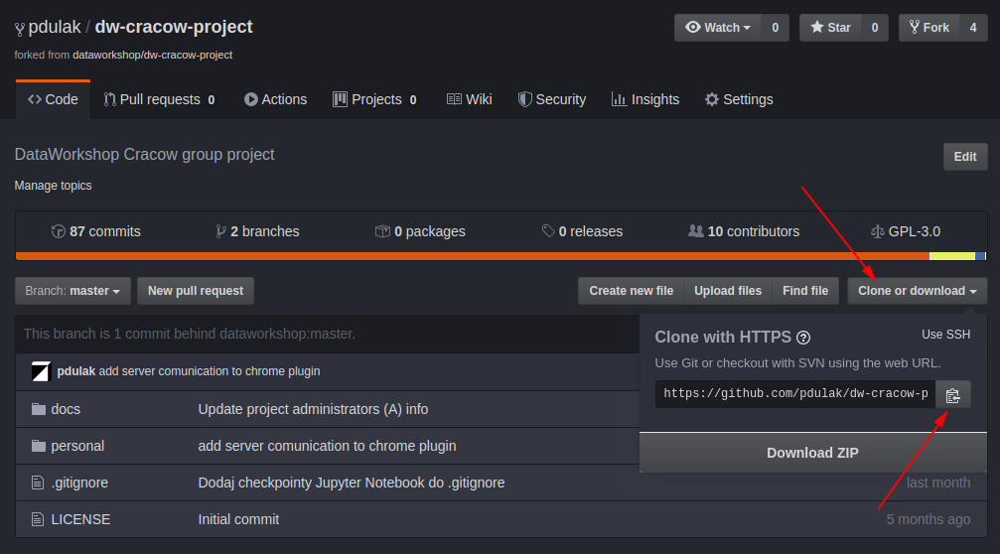

# Jak używać gita podczas pracy nad naszymi projektami

## Git to nie Github

Git to narzędzie - program do kontrolowania wersji kodu który piszemy. Git tworzy i zarządza repozytoriami kodu.
GitHub to miejsce gdzie możemy nasze repozytoria przechowywać, zarządzać nimi w bardziej ogólny sposób. 

## Pierwsze kroki

1. Załóż konto na GitHub jeśli jeszcze go nie posiadasz
2. Nasze projektowe repozytorium znajduje się na GitHub pod adresem:
https://github.com/dataworkshop/dw-cracow-project/
3. Będąc zalogowanym do GitHub możesz wejść na stronę naszego repozytorium i kliknąć `Fork` w prawym górnym rogu strony. Fork to Twoja prywatna kopia naszego repozytorium. Masz nad nim pełną władzę i możesz pracować w nim nie obawiając się że coś zepsujesz w naszym repozytorium projektowym.

## Mam już swój Fork i co dalej? (lokalne repozytorium Git)

Do pracy z narzędziem Git polecam linię poleceń (konsolę). Można używać także narzędzi wizualnych (Git GUI) czy obsługi Git wbudowanej w edytor programistyczny, ale wszystkie komendy w tym dokumencie będą się odnosić do konsoli z obsługą Git.

1. Zainstaluj Git na swoim komputerze. W Linux zazwyczaj wystarczy w konsoli wpisać: `sudo apt install git`, dla Windows można pobrać na przykład z https://git-scm.com/download/win
2. Załóż katalog w którym będziesz pracować, w tym miejscu utworzymy lokalną kopię Twojego repozytorium. Uruchom konsolę Git tak żeby pracowała w tym nowo utworzonym katalogu. 
3. Na stronie GitHub otwórz sobie swoje repozytorium, po prawej stronie ekranu znajdziesz przycisk "Clone or download". Po jego kliknięciu pojawi się małe okno z adresem repozytorium. Ten adres należy skopiować. Ważne żeby pobrać wersję HTTPS chyba że wiesz co robisz pobierając wersję SSH :) 
4. W konsoli Git na swoim komputerze wykonaj komendę: `git clone [tutaj skopiowany adres]` czyli na przykład: `git clone https://github.com/kowalski/dw-cracow-project.git`. W ten sposób utworzyłeś lokalną kopię swojego repozytorium, na której będziesz pracować lokalnie.

## Codzienna praca z Git

Podczas swojej codziennej pracy z repozytorium staraj się utrzymywać swój kod w katalogu `/personal/[Twój Nick]` w ten sposób nie zrobisz bałaganu. Warto na poszczególne mniejsze projekty zakładać dodatkowe podkatalogi albo odpowiednio nazywać pliki. 

Git służy do kontroli wersji kodu który piszesz. Nie robi tego jednak automatycznie. Należy co jakiś czas wprowadzić swoje zmiany do repozytorium. Taką operację nazywa się `commit`. W jej wyniku Git zapamięta stan Twojego repozytorium, a właściwie tych plików które będziesz chciał zapamiętać. 

### Commit

Aby wykonać `commit` swoich zmian, należy najpierw wskazać Gitowi które pliki chcesz uwzględnić. Robi się to wykonując komendę: `git add [ścieżka i nazwa pliku]` czyli na przykład `git add personal/kowalski/test.py` W ten sposób przygotowaliśmy plik - nazywa się to `staging`. 

Możemy też dodawać pliki "hurtem" pisząc na przykład: `git add personal/kowalski/*.py` aby dodać wszystkie pliki z rozszerzeniem `.py`

Mając przygotowane wszystko co chcemy, wykonujemy komendę `git commit` która wprowadzi nasze zmiany do lokalnego repozytorium. Zostanie otworzony edytor w którym powinniśmy wpisać komentarz do naszych zmian. Jeśli chcemy wstawić komentarz od razu przy wykonywaniu komendy, można to zrobić pisząc: `git commit -m "Treść komentarza"`

Commity powinny być małe, częste i spójne (dotyczące danej funkcjonalności). Commit nie musi działać ani "się kompilować" bo commit dokumentuje kroki Twojej pracy.

### Ignorowanie plików

Jeśli czegoś nie chcemy zachowywać w naszym repozytorium (pliki z danymi, pliki tymczasowe, pliki z hasłami i tokenami), należy je wykluczyć za pomocą odpowiedniego wpisu w pliku `.gitignore`. Plik ten zakładamy w swoim katalogu `personal` i wpisujemy do niego nazwy plików lub katalogów które nie powinny być brane pod uwagę przez Git. Każdy wpis zajmuje osobną linijkę. Przykładowa treść pliku `.gitignore`:

```
*.tmp
tego-nie-commituj.txt
data/*
```

Powyższy plik `.gitignore` wskazuje że powinny być ignorowane wszystkie pliki z rozszerzeniem `.tmp`, plik o nazwie `tego-nie-commituj.txt` oraz cała zawartość katalogu `data`

### Wysyłanie zmian do GitHub

Warto aby Twoje zmiany do repozytorium nie pozostawały wyłącznie na Twoim komputerze. Aby wysłać je do Twojego repozytorium na GitHub, wykonaj polecenie `git push origin master` - spowoduje to "wypchnięcie" Twoich zmian do zdalnego repozytorium na GitHub.

## Wysyłanie moich zmian do głównego repozytorium projektu - Pull Request

## Pobieranie aktualnej wersji repozytorium projektu - fetch from upstream, merge

## Praca na branchach

## merge -> odsyłam do kursów git

## Materiały dodatkowe

* https://devstyle.pl/2018/10/26/5-sposobow-na-prace-z-gitem/

## Uwagi

### Instalacja Win: git-scm.com

Windows Explorer Integration -> Git Bash here
Default Text Editor -> VIM
Use Git From -> Windows Command Prompt
Terminal Emulator -> MinTTY

### Konfiguracja git

git config --global user.name "Jan Kowalski"
git config --global user.email "jan.kowalski@gmail.com"

windows - można użyć:
git config core.editor notepad

## Komendy

git clone [skąd]
git clone [skąd] .
git add
git add [nazwa_pliku]
git add [*.py]
git add -i = dodawanie interaktywne
git add -p = dodawanie w trybie patch plik po pliku
git commit
git status
git diff
git diff --word-diff
git diff --cached = zmiany w staging area
git difftool
git log
git log --oneline
git log -n4 
git log --since='{15 minutes ago}'
git tag [nazwa_tagu] = ten jest 'lightweight'
git tag [nazwa_tagu] -a -m "komentarz" = ten jest annotated
git tag [nazwa_tagu] [commitSHA] -a -m 
git tag -d [nazwa_tagu] 
git branch [nazwa_nowej_gałęzi]
git branch = lista gałęzi
git branch -d = kasowanie
git branch -m [nowa_nazwa_branch] = rename aktualnej gałęzi
git branch -vv = pokazuje także związki branchy z remote
git branch -a = pokazuje także gałęzie zdalnych repozytoriów o których wie nasz lokalny git
git checkout [branch_name]
git checkout [tag_name]
git checkout [commitSHA]
git checkout [commitSHA~4]
git checkout -b [nazwa_nowej_gałęzi]
git checkout @^ -- nazwa_pliku = pobiera do working copy wersję pliku z commit HEAD -1
git checkout [commitSHA] -- nazwa_pliku = pobiera wersję pliku z konkretnego commit
git checkout -- nazwa_pliku = pobiera wersję pliku z HEAD
git merge
git merge --no-ff
git cherry-pick [commitSHA]
git remote
git remote -v
git remote show origin
git remote add [nazwa_remote] [adres]
git remote rename [stara_nazwa] [nowa_nazwa]
git push
git init --bare
git push [jaki_remote] [jaki_branch]
git push [jaki_remote] [jaki_branch] -u = dodaje mapowanie do upstream branch na przyszłość
git push [jaki_remote] [jaki_branch]:[nazwa_branch_w_remote] = wysyła mój branch do brancha o innej nazwie w remote
git push [jaki_remote] :[nazwa_w_remote] = wysyłam "nic" do brancha w remote czyli kasuję tamten branch w remote
git push [jaki_remote] --delete [nazwa_w_remote] = jak wyżej
git push --mirror [jaki_remote] = wysyła wszystko, gałęzie, tagi itp
git push [jaki_remote] [nazwa_tagu]
git push --tags = wysyła wszystkie tagi, nie jest rekomendowany bo wysyła także tagi tymczasowe itp
git push --follow-tags = wysyła tylko tagi typu annotated, ale wszystkie
git fetch = aktualizuje tracking branch, nie modyfikuje naszych gałęzi
git fetch --prune --prune-tags
git fetch --no-tags
git pull = fetch + merge
git reset = czyści staging area\
git reset [commitSHA] = "przewija" branch do podanego commita
git clean -n = co by zrobił
git clean -i = interactive mode
git clean -f = force (kasuje)
git clean -d = pracuje także na katalogach
git clean -fd = force wraz z katalogami
git clean -fdx = kasuje również pliki ignorowane
git stash = zapisanie ukrytego commita
git stash -u = stash razem z untracked files
git stash save -u "description of stash" = preferowany sposób, z komentarzem
git stash list
git stash pop


## Nawigacja

commitSHA~X - X commitów wcześniej
commitSHA^^^ - 3 commity wcześniej
git log tag1..tag2 - od tag1 (bez) do tag2 (włącznie)

## Słowniczek

### Repo, repozytorium

Katalog na dysku, zawierający informację o wszystkich plikach projektu, jego historii i aktualnym stanie (w uproszczeniu).

### Commit 

Stan repozytorium w danym momencie. Zawiera także informacje o czasie utworzenia, autorze, komentarz.

### Working copy, working directory, katalog roboczy

Katalog w którym aktualnie pracujesz. Ze zmian na plikach w Working Copy tworzone są commity (kolejne wersje repozytorium).

### Tag

Wskaźnik, referencja do konkretnego commitu - komentarz, autor jest opcjonalny. Inaczej etykieta lub nazwa konkretnego commita.

### Branch, gałąź

Kopia repozytorium, można na niej pracować niezależnie od pozostałych kopii. Fizycznie znajduje się w tym samym katalogu, ale na czas pracy na innej gałęzi pliki są zamieniane.

Branch składa się z commitów. Ostatni commit jest nazywany "tip".

Umożliwia wygodną pracę wielu osób. Ale uwaga - nie w tym samym katalogu (Working Copy) ponieważ w danym momencie możemy mieć aktywną tylko jedną gałąź w danym Working Copy.

Pozwala wydzielić grupy commitów (związane na przykład z daną funkcją) na widoku historii repozytorium.

### master

Domyślna nazwa pierwszej gałęzi w repozytorium Git. 

### tip

Najnowszy (ostatni) commit w danym branchu.

### head (małe litery)

Wskaźnik na tip 

### HEAD (wielkie litery), także pod aliasem @

Commit będący źródłem aktualnej zawartości working copy (aktualny commit)

### Detached head

Stan w którym zrobiliśmy checkout na commit który nie jest tipem jakiegoś brancha.

W takim stanie możemy tworzyć commity ale nie będą dowiązane do żadnej historii. Dlatego warto wykonać:

git checkout -b nowa_gałąź_z_detached_state

W ten sposób zaczynamy pracę na nowej gałęzi która wywodzi się z commita na którym jesteśmy w detached state. W ten sposób też wychodzimy ze stanu detached state na nową gałąź.

Innym sposobem powrotu do "normalności" jest checkout na master lub jakiś inny branch:

git checkout master

### merge

Łączenie zmian (commitów) z dwóch lub więcej gałęzi

### cherry pick

Kopiuje pojedynczy commit między gałęziami. Z tego powodu warto żeby commity zawierały jak najmniej zmian w sobie - można wtedy wybrać ten (albo te) które chcemy użyć jako cherry pick

### Remote

Remote to zdalne repozytorium. Może być na GitHub, na jakimś innym serwerze, może też być innym katalogiem na dysku.

### Origin

Domyślna nazwa zdalnego repozytorium z którego zrobiliśmy clone. 

### Bare repository

Repozytorium bez Working Copy czyli takie na którym nie da się bezpośrednio pracować. Jest to repozytorium serwerowe, które służy do wymiany kodu, jako źródło do clone itd.

### Upstream

Repozytorium nadrzędne, na przykład źródło fork z którego obecnie korzystamy. Mamy zatem Upstream, z niego zrobiony Fork, z niego zrobiony Clone na swój komputer.

### Upstream branch

Odpowiednik lokalnej gałęzi na zdalnym repozytorium. Git potrafi śledzić zmiany między nimi, push i pull domyślnie wiedzą których gałęzi dotyczą. Co więcej, mogą mieć różne nazwy, ważne jest że Git potrafi je poprawnie mapować na siebie.

### tracking branch

Lokalna gałąź reprezentująca zdalną gałąź (np. origin/master) - nie da się na niej pracować bezpośrednio. 

### staging area / cache / index

To co będzie w następnym commit - coś między komendami add i commit. Można tutaj umieścić jeden z wielu zmienionych plików. Można też umieścić część zmian z jednego pliku. 

### hunk 

Zakres zmian w pojedynczym pliku. Część interpretowana przez git jako coś co się w pliku zmieniło i może być oddzielone od innych zmian w tym samym pliku. Czasem jest to jedna linijka, czasem kilka linijek następujących po sobie. 