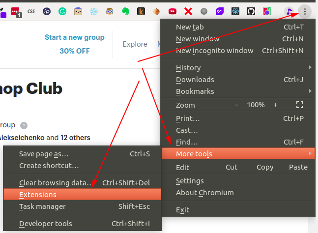
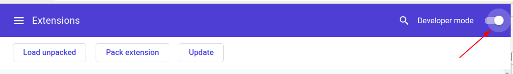
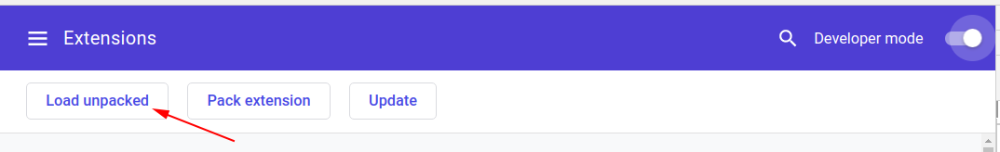
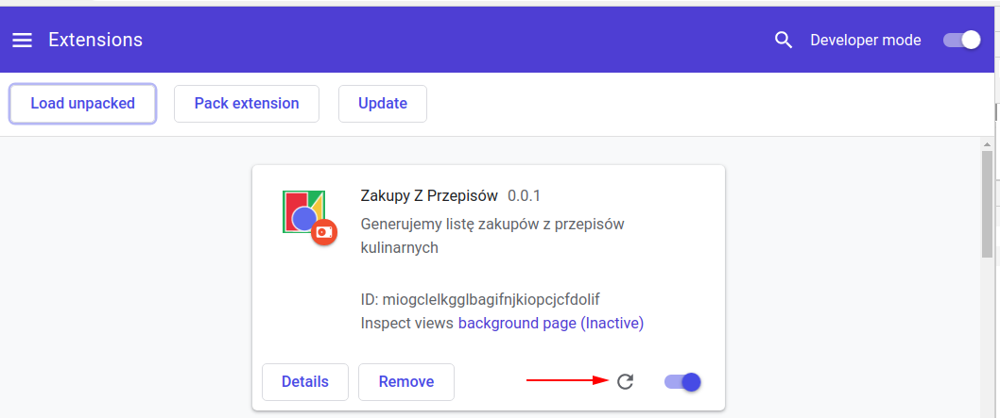
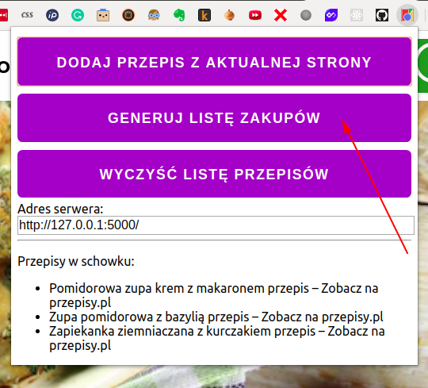
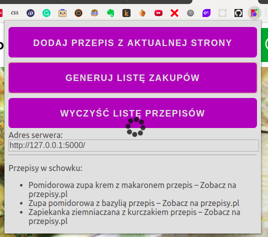
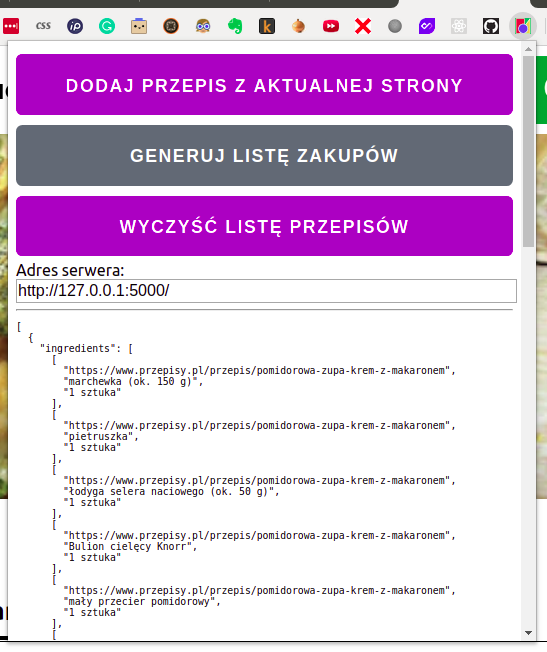

## Używanie rozszerzenia w przeglądarce Chrome

To jest rozszerzenie do Chrome (i Opery) które obecnie działa tylko w trybie developerskim. 

## Instalacja

1) wejść w menu Chrome -> More Tools -> Extensions 
2) przełączyć rozszerzenia w Developer Mode 
3) kliknąć "Load unpacked" aby załadować rozszerzenie 
4) pojawi się okno w którym należy przejść do *katalogu* w którym jest rozszerzenie i kliknąć "Open" - ważne - wybieramy katalog, nie plik
5) rozszerzenie pojawi się na liście zainstalowanych. Jeśli będziesz wykonywać jakieś zmiany do kodu samego rozszerzenia jako takiego, pamiętaj że możesz je odświeżyć klikając tutaj: 

## Użytkowanie

Pamiętaj że do używania tego rozszerzenia jest także potrzebny działający serwer który będzie odbierał listę przepisów a odsyłał listę zakupów. 

1) Będąc na stronie z przepisem kliknij ikonę rozszerzenia a następnie "Dodaj przepis z aktualnej strony":
2) Kiedy wybierzesz już jeden lub więcej przepisów, kliknij "Generuj listę zakupów" 
3) Rozszerzenie wysyła Twoją listę przepisów na serwer, serwer stara się zebrać składniki i odesłać je do rozszerzenia. Im więcej przepisów tym dłużej to trwa - nawet kilka do kilkunastu sekund 
4) Dane przesłane z sewera są prezentowane bez dalszej obróbki (na razie) 

## To do

* wyświetlanie listy zakupów bezpośrednio w formie odebranej z serwera (serwer będzie przygotowywał gotowy HTML)
* klikalna lista zebranych przepisów z możliwością usunięcia
* obsługa duplikatów przepisów 
* ikona
* obsługa błędów